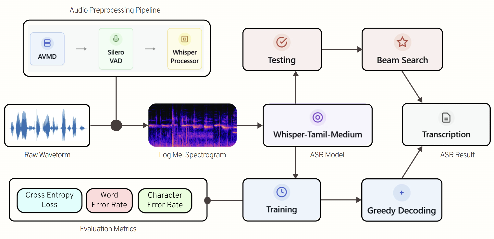

# CrewX@LT-EDI-2025: Transformer-Based Tamil ASR with AVMD Denoising and GRU-VAD 🎯

[](https://www.python.org/downloads/)
[](https://pytorch.org/)
[](https://github.com/huggingface/transformers)
[](https://github.com/openai/whisper)
[](https://sites.google.com/view/lt-edi-2025)
[](https://github.com/Ganesh2609/VulnerableSpeechASR)
[](https://en.wikipedia.org/wiki/Tamil_language)
[](LICENSE)

This repository contains the implementation of our state-of-the-art Tamil Automatic Speech Recognition (ASR) system designed for elderly and transgender populations. Our approach achieved **1st place** in the LT-EDI 2025 shared task with a Word Error Rate (WER) of **31.9**.

## 📋 Overview

We present an improved Tamil ASR system that addresses unique language challenges through a comprehensive pipeline integrating:
- Adaptive Variational Mode Decomposition (AVMD) for selective noise reduction
- Silero Voice Activity Detection (VAD) with GRU architecture
- Fine-tuned OpenAI Whisper model optimized for Tamil transcription
- Beam search decoding during inference



## ✨ Key Features

- **Selective Denoising**: AVMD applied only to noisy signals based on SNR threshold
- **Voice Activity Detection**: Removes silence segments > 300ms for improved accuracy
- **Transformer Architecture**: Leverages Whisper-Tamil-Medium model fine-tuned on custom dataset
- **Beam Search Decoding**: Enhances transcription accuracy during inference
- **Comprehensive Metrics**: Tracks WER, CER, and Cross-Entropy Loss

## 🚀 Installation

```bash
# Clone the repository
git clone https://github.com/Ganesh2609/VulnerableSpeechASR.git
cd VulnerableSpeechASR

# Install requirements
pip install torch torchaudio
pip install transformers
pip install librosa soundfile tqdm
pip install torchmetrics
pip install PyEMD
pip install chardet
```

## 📁 Project Structure

```
VulnerableSpeechASR/
├── AVMD/
│   └── apply_avmd.py                # AVMD denoising implementation
├── Silero VAD/
│   └── apply_vad.ipynb             # Voice Activity Detection notebook
├── Whisper ASR/
│   ├── dataset.py                  # Data loader implementation
│   ├── trainer.py                  # Modular training framework
│   ├── training_whisper.py         # Main training script
│   └── logger.py                   # Training logger
├── Beam Search Decoding/
│   └── apply_beam_Search.py        # Inference with beam search
└── README.md
```

## 🔧 Usage

### 1. Data Preprocessing

#### Apply AVMD Denoising
```python
python AVMD/apply_avmd.py
```
This selectively applies AVMD to noisy audio files (SNR < 20 dB).

#### Apply Voice Activity Detection
```python
# Run the Jupyter notebook
jupyter notebook "Silero VAD/apply_vad.ipynb"
```
Removes silence segments longer than 300ms.

### 2. Model Training

```python
python "Whisper ASR/training_whisper.py"
```

Training configuration:
- Model: `vasista22/whisper-tamil-medium`
- Optimizer: AdamW (lr=1e-5, weight_decay=1e-2)
- Scheduler: ReduceLROnPlateau
- Batch size: 4
- Epochs: 16 (configurable)


### 3. Inference with Beam Search

```python
python "Beam Search Decoding/apply_beam_Search.py"
```

Generates transcriptions using beam search decoding (beam_size=5).

## 📊 Results

Our system achieved state-of-the-art performance in the LT-EDI 2025 shared task:

| Rank | Team Name | WER (%) |
|------|-----------|---------|
| 1    | CrewX     | 31.90   |
| 2    | NSR       | 34.85   |
| 3    | Wictory   | 34.93   |
| 4    | JUNLP     | 38.42   |
| 5    | SSNCSE    | 42.30   |

### Performance Metrics (Best Model)

| Metric | Train | Validation | Test |
|--------|-------|------------|------|
| Loss   | 0.202 | 0.281      | -    |
| WER    | 45.212| 49.095     | 31.9 |
| CER    | 7.061 | 9.037      | -    |

## 🗂️ Dataset

The dataset consists of 7.5 hours of spontaneous Tamil speech targeting vulnerable elderly and transgender individuals:

| Split | Audios | Duration (hours) |
|-------|--------|------------------|
| Train | 726    | 4.4              |
| Dev   | 182    | 1.1              |
| Test  | 451    | 2.0              |

## 🏆 Key Contributions

1. **AVMD Integration**: First to apply Adaptive VMD for Tamil ASR with selective noise reduction
2. **Pipeline Optimization**: Comprehensive preprocessing pipeline tailored for Tamil speech
3. **Vulnerable Populations**: Specifically designed for elderly and transgender individuals
4. **SOTA Performance**: Achieved top performance in competitive shared task

## 👥 Authors

- **Ganesh Sundhar S**
- **Hari Krishnan N**
- **Arun Prasad TD**
- **Shruthikaa V**
- **Jyothish Lal G**

Amrita School of Artificial Intelligence, Coimbatore  
Amrita Vishwa Vidyapeetham, India

## 🔗 Resources

- [Shared Task Description](https://codalab.lisn.upsaclay.fr/competitions/21879)
- [Whisper Tamil Model](https://huggingface.co/vasista22/whisper-tamil-medium)

## 🙏 Acknowledgments

We thank the organizers of LT-EDI 2025 for providing the dataset and evaluation platform.
